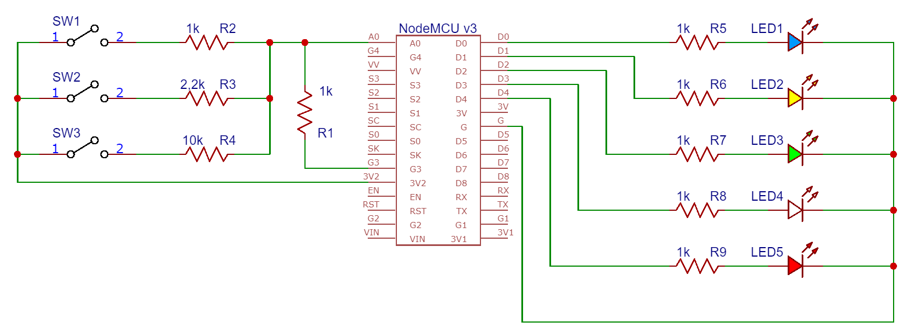

## Description

This folder contains various implementations of the vacuum example from the [Getting Started](https://jason.sourceforge.net/mini-tutorial/getting-started/) documentation of the [Jason interpreter](http://jason.sourceforge.net/wp/).

* v1: vacuum moves and cleans dirty spaces when `SW2` is closed.
* v2: vacuum starts when `SW1` is closed and cleans dirty spaces when `SW2` is closed.
* v3: vacuum starts when `SW1` is closed, cleans dirty spaces when `SW2` is closed, and empties dust deposit when `SW3` is closed.

For reference, the circuit should look as follows:

Where the analog interface is used to detect various buttons. The values read from the analog interface (A0) correspond to different switches states, represented in the table below:

| SW1 (Start)  |  SW2 (Dirt)  | SW3 (Full_Deposit) |  Value |
| :---: | :---: | :---: | :---: | 
| 0 | 0 | 0 | 10 |
| 0 | 0 | 1 | 116 |
| 0 | 1 | 0 | 368 |
| 0 | 1 | 1 | 423 |
| 1 | 0 | 0 | 589 |
| 1 | 0 | 1 | 615 |
| 1 | 1 | 0 | 693 |
| 1 | 1 | 1 | 715 |

----

## How to run the examples

To run each example, place the files from each subfolder on its corresponding locations and run `make agent`. The executable will be compiled and uploaded to the nodeMCUv3.

|      File      |            Location            |
|:--------------:|:------------------------------:|
|  agent.config  |      nodemcuv3-embedded-bdi/     |
| CMakeLists.txt |   nodemcuv3-embedded-bdi/main/   |
| agent_loop.cpp |  nodemcuv3-embedded-bdi/main/src/ |
|  agent_loop.c  |  nodemcuv3-embedded-bdi/main/src/ |
|   functions.h  | nodemcuv3-embedded-bdi/main/data/ |
|  functions.cpp | nodemcuv3-embedded-bdi/main/data/ |
| agentspeak.asl | nodemcuv3-embedded-bdi/main/data/ |